# Chase project

## Overview

Chase is a project/sprint management app that was inspired by Notion's Kanban. This project was made so that I can practice my current tech stack, and the new technologies that I've been wanting to learn. Here are the following tech stack for this project:

- ReactJS
- Context API
- React Router
- styled-components
- Firebase/Firestore

## Features

**Register Feature**
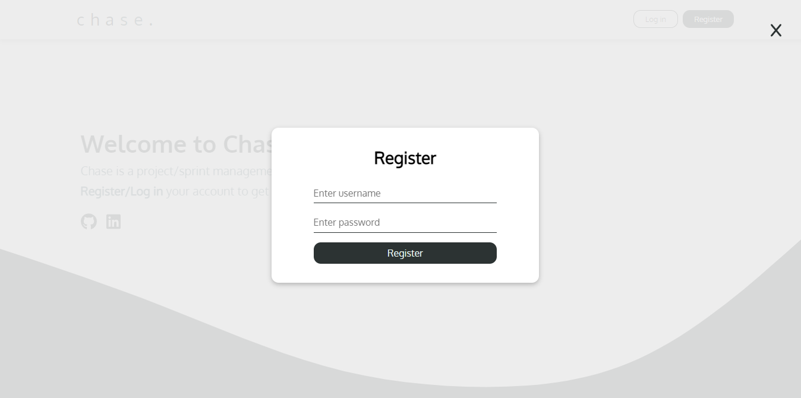

**Login Feature**
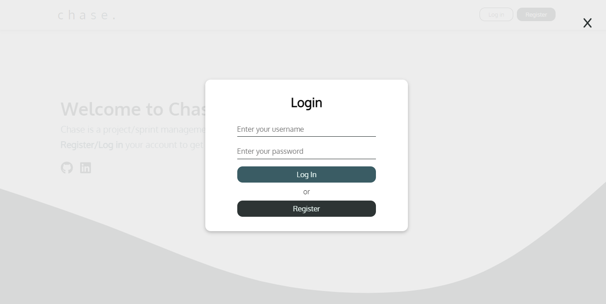

**Projects Feature**

- Projects Dashboard
  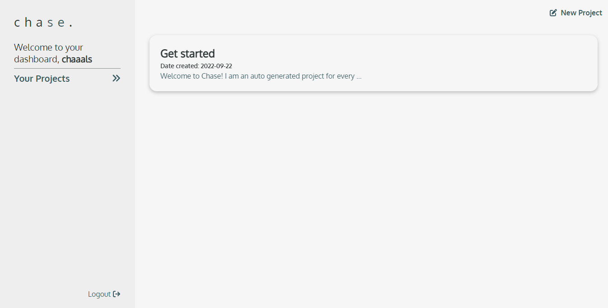
- Creating a Project
  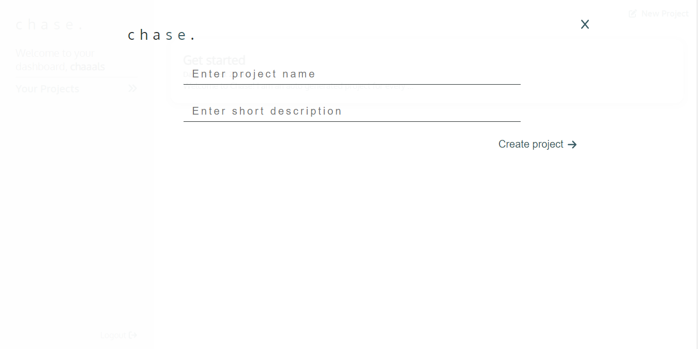
- Project Preview
  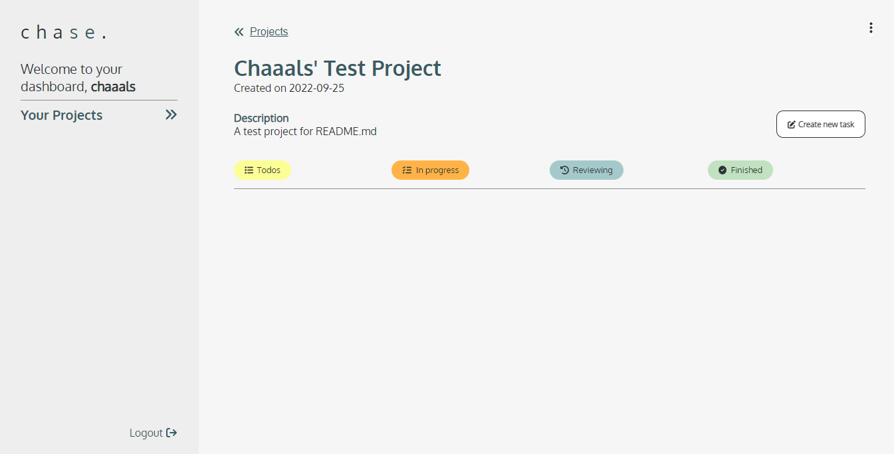
  - Project Edit
    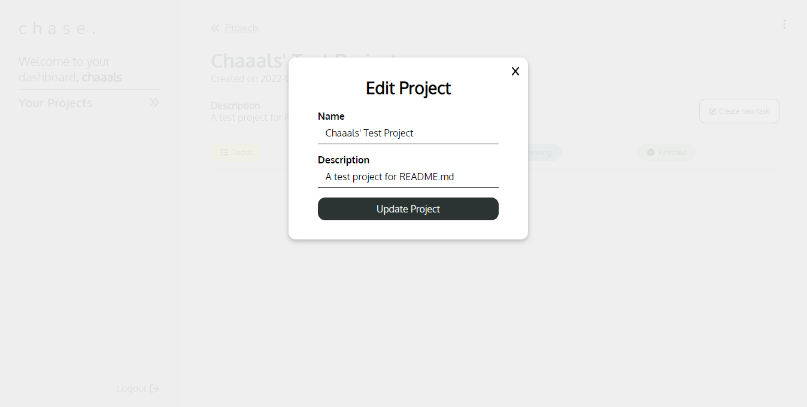
  - Create Task
    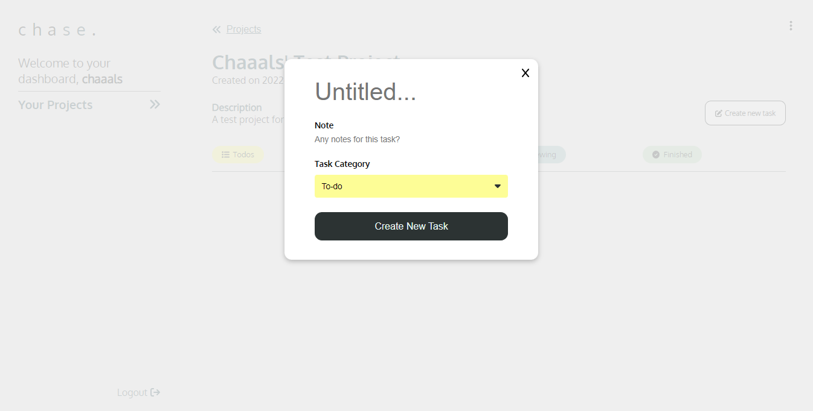
  - Created Tasks
    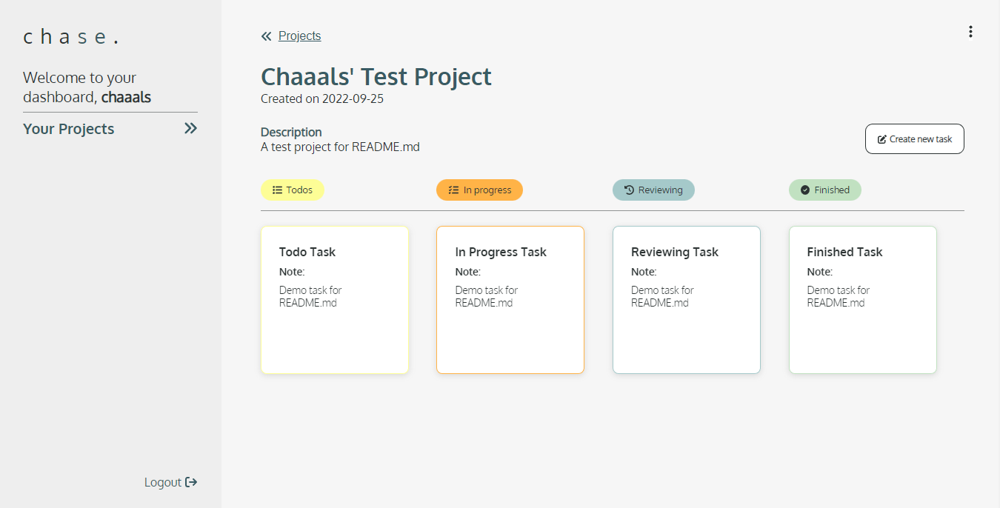
  - Task View
    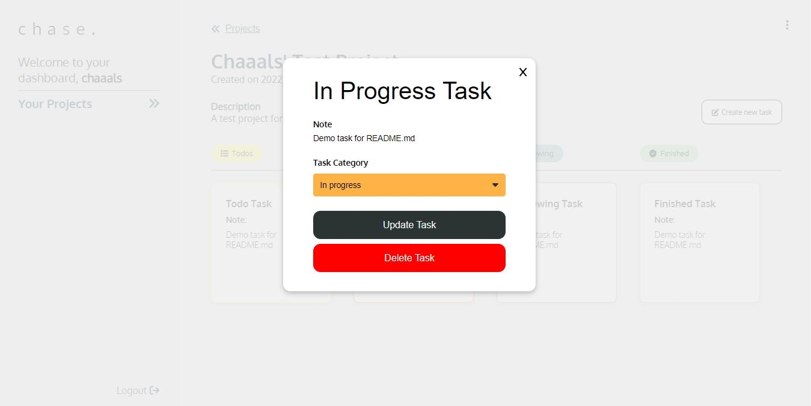
  - Task Update
    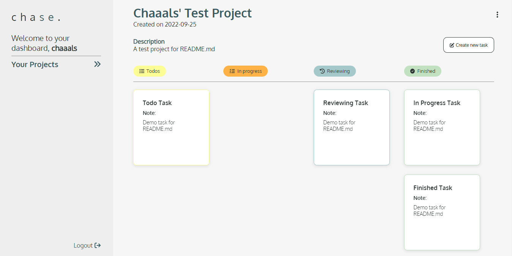
  - Task Delete
    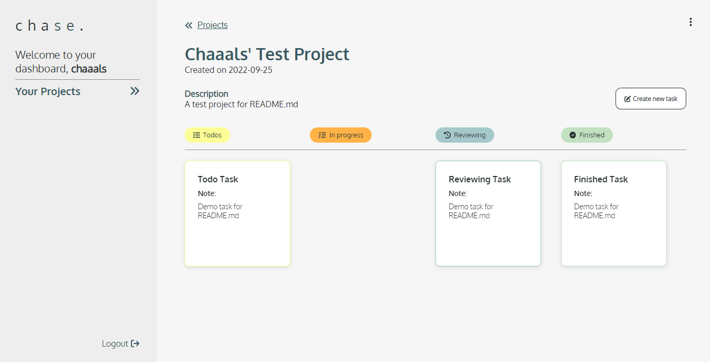
- Project Delete
  - Pre-deletion
    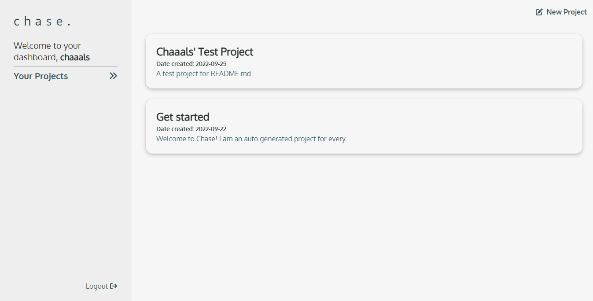
  - Deletion
    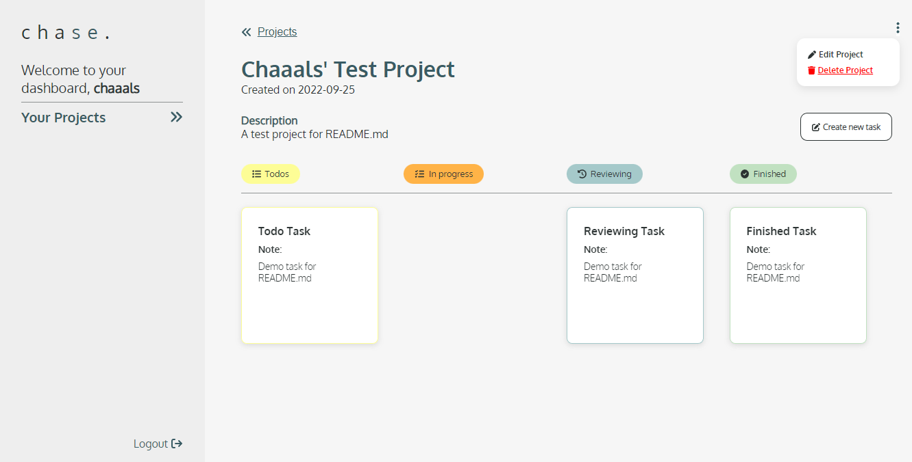
  - Deleted
    

### Designed and developed with ❣️

by Charles Ching 🤓
